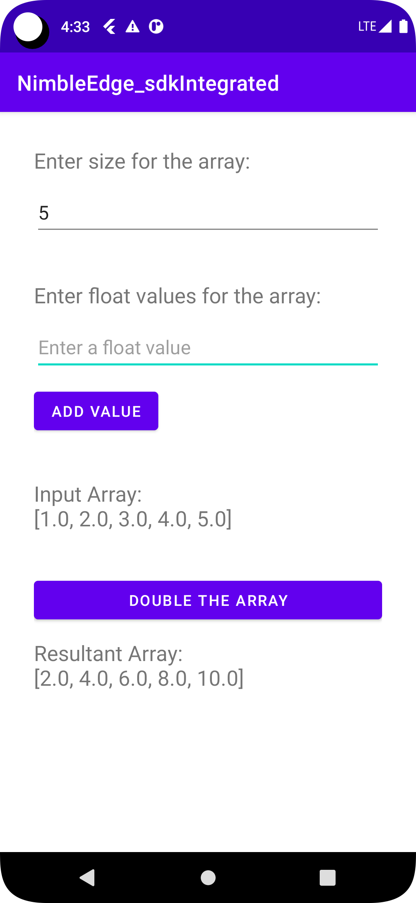

# NimbleEdge_sdkIntegrated

## **Task Brief:**

1. Managing and releasing android SDK libraries

2. Kotlin and C++ interoperability

3. Memory management of objects when passing them between kotlin and C via JNI

  
  

